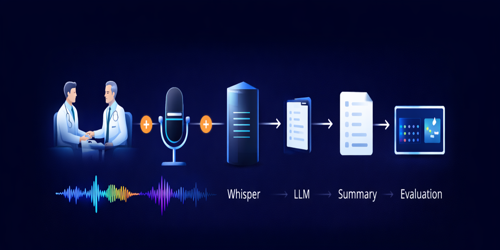

This repository contains the pipeline and evaluation code accompanying the paper:

> **Embedding-Based Evaluation and Benchmarking Framework for Optimizing LLM Post-Processing of Medical Transcriptions from a Local Whisper System**

**Authors:**  
Ahmad WATTARᵃ, Jan CHRISTOPHᵃ, Christoph DEMUSᵃ, Patrick LIEGELᵃ, and Christian JÄGERᵃ¹  

Notebook-basierte Evaluation von Whisper-Transkripten und LLM-Postprocessing
mit Fokus auf semantische Ähnlichkeit und Konsistenz (Embeddings),
inklusive Plots und Gegenexperimenten zur Analyse der Modellstabilität.

## Projektidee
Dieses Repository untersucht, wie verschiedene LLMs ASR-Transkripte (z. B. aus Whisper) nachbearbeiten/umformulieren
und wie **konsistent** diese Änderungen über unterschiedliche Domänen hinweg sind (medizinisch vs. nicht-medizinisch).

Die Analyse basiert auf:
- **Embeddings** (semantische Ähnlichkeit): Bedeutungsebene via mehrere Embedding-Backends

## Repository-Struktur
- `Gegenexperiment/` – Gegenexperimente für nicht-medizinische Texte
- `elab_request/` – Export/Abholung von Experimenten & Transkripten (z. B. aus eLab) als JSON für die Analyse
- `embedding/` – Embedding-basierte Similarity- und Distanz-Berechnung sowie Modellvergleiche
- `plots/` – generierte Abbildungen für Reporting
- `temperature_experiments/` – Analyse der Auswirkung verschiedener Temperatur-Parameter auf die Konsistenz und Stabilität der Outputs des MedGemma-Modells
- `extended_analysis/` – zusätzliche Experimente und vertiefende Auswertungen

## Daten / Large-Files
Alle Parquet-Dateien werden ausgeschlossen, damit das Repo schlank bleibt und GitHub-Dateigrößenlimits nicht überschritten werden.
Diese Dateien werden separat über **Zenodo** bereitgestellt.

If you use this code, please cite the accompanying paper 