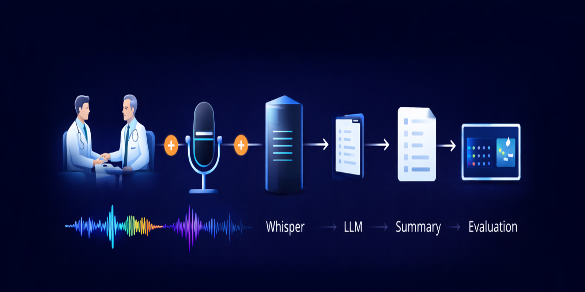

# Embedding-Based Evaluation and Benchmarking Framework for Optimizing LLM Post-Processing of Medical Transcriptions from a Local Whisper System

This repository contains the pipeline and evaluation code accompanying the paper:

> **Embedding-Based Evaluation and Benchmarking Framework for Optimizing LLM Post-Processing of Medical Transcriptions from a Local Whisper System**

**Authors:**  
Ahmad WATTAR, Jan CHRISTOPH, Christoph DEMUS, Patrick LIEGEL, and Christian JÄGER

Notebook-based evaluation of Whisper-generated transcriptions and LLM-based post-processing, with a focus on semantic similarity and output consistency using embedding-based metrics. The repository also includes visualizations and counter-experiments for analyzing model robustness and stability.

## Project Overview

This repository investigates how different Large Language Models (LLMs) post-process and reformulate Automatic Speech Recognition (ASR) transcripts (e.g., generated by Whisper) and evaluates how consistently these modifications are applied across different domains (medical vs. non-medical).

The analysis is based on:

- **Embeddings (Semantic Similarity):** Meaning-preserving comparison using multiple embedding backends.
- **Cross-domain consistency analysis:** Evaluation of model behavior across medical and general-language content.
- **Comparative benchmarking:** Assessment of different LLMs and parameter settings.
- **Visualization and reporting:** Generation of plots and statistical summaries for result interpretation.

## Repository Structure

- `counter_experiments/` – Counter-experiments using non-medical texts for comparison.
- `elab_request/` – Export and retrieval of experiments and transcripts (e.g., from eLab) as JSON files for downstream analysis.
- `embedding/` – Embedding-based similarity and distance calculations, including model comparisons.
- `plots/` – Generated figures and visualizations used for reporting.
- `temperature_experiments/` – Analysis of the impact of different temperature settings on the consistency and stability of MedGemma outputs.
- `extended_analysis/` – Additional experiments and extended evaluations.

## Data / Large Files

All Parquet files are excluded from version control to keep the repository lightweight and to avoid GitHub file size limitations.

These files are provided separately via **Zenodo**.

## Notes

A reusable prompt template is available in `prompt_template.md`.

## Citation

If you use this code or methodology in your research, please cite the accompanying paper.
